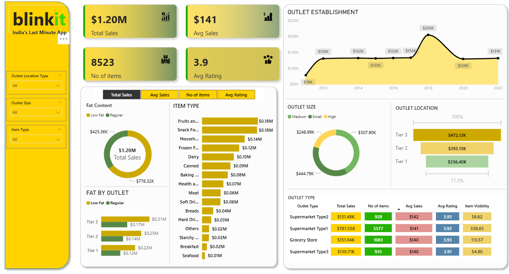

**Project Title:** Blinkit Sales Performance Dashboard

**Purpose of the Project:**
The project aims to analyze sales, revenue, customer preferences, and product performance for Blinkit (an online grocery delivery platform). The dashboard helps business users quickly identify top-performing product categories, track revenue trends, and understand customer purchasing behavior for better decision-making.

**Key Objectives:**

* Monitor overall sales and revenue performance.
* Analyze product categories and sub-categories contributing to revenue.
* Identify customer purchase trends and preferences.
* Provide management with an interactive, visual dashboard for decision support.

**Technologies Used:**

* **Power BI** – for data visualization and dashboard creation.
* **DAX (Data Analysis Expressions)** – for calculated measures and KPIs.
* **Power Query (M Language)** – for data transformation and cleaning.

**Data Source:**

* The dataset is extracted from **Blinkit’s sales data (CSV/Excel format)**.
* Data is pre-processed using Power Query before being loaded into the Power BI data model.
* Data Model includes relationships between products, categories, sales, and customers.

**Key Features of the Dashboard:**

* KPI cards to show total sales, revenue, and profit.
* Category-wise and sub-category-wise analysis of sales.
* Customer segmentation insights.
* Trend analysis using time-based visuals.
* Fully interactive filters and slicers for deep dive analysis.

**Project Impact:**
This dashboard enables business leaders to identify profitable product lines, optimize inventory, and enhance customer satisfaction by making data-driven decisions.

**Keywords :** Power BI, Data Visualization, Business Intelligence, Sales Dashboard, Blinkit, DAX, Power Query, Interactive Dashboard.

📸 Preview

Show what the dashboard look like: 

